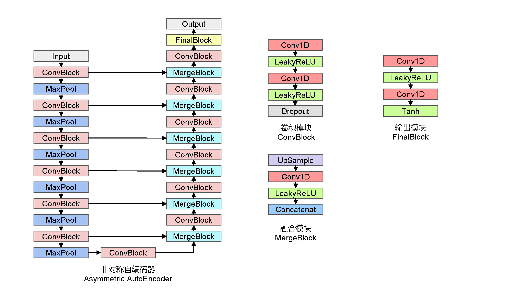

# ASEGAN: Speech Enhancement Generative Adversarial Network Based on Asymmetric AutoEncoder
[中文版简介](README.md)  
[Readme with English Version](README_en.md)

#### 介绍
基于SEGAN模型的改进版本，使用自主设计的非对称自编码结构替换原有的全卷积结构，使得模型在保持原有性能的条件下更加轻量化。  
（本模型未在任何期刊发布）

#### 软件架构

#### 安装教程

1.  安装必要库  
    [Anaconda](https://www.anaconda.com/)  
    [cuda](https://developer.nvidia.com/zh-cn/cuda-toolkit)  
    [cudnn](https://developer.nvidia.com/zh-cn/cudnn)
2.  创建python环境  
    `conda create -n ASEGAN python=3.8`  
    `conda activate ASEGAN`
3.  安装必要环境  
    `pip install -r requirements.txt`  
    或者`conda install --yes --file requirements.txt`

#### 使用说明
    使用前检查config/config.yaml中参数配置是否正确，数据集文件结构参考data文件夹中结构
1.  数据预处理  
    `python data_preprocess.py`
2.  模型训练  
    `python train.py`
3.  模型测试  
    `python test.py`
    
#### 预训练模型下载
[百度网盘，提取码6793](https://pan.baidu.com/s/11xzTzrP7WkchQWk55Z0bKw)  
[GoogleDrive](https://drive.google.com/drive/folders/1RVKEbCnQyEMmA6JOoqSNnbRnLEghdhvq?usp=sharing)  
预训练模型命名方式为‘数据集-训练周期-数据量.pkl’